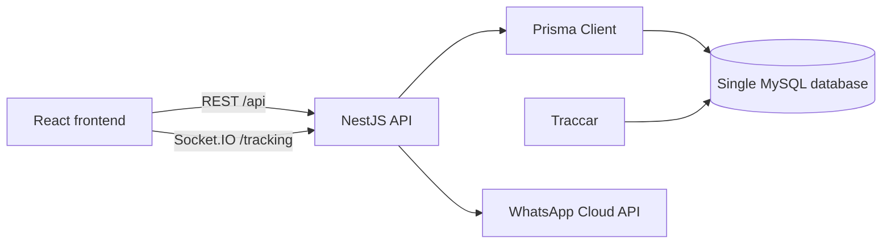

# Architecture

## Ownership and tenancy

`tc_*` tables remain Traccar's source of truth for devices, positions, events,
and geofences. Fleet Platform writes only `fm_*` tables. When configured with
Traccar API credentials, it creates requested geofences through Traccar's REST
API rather than writing `tc_*` directly. Every Fleet-owned
operational record is scoped by `company_id`; REST services and Socket.IO rooms
use that tenant boundary.

## Backend

Nest modules use controller → service → repository/Prisma layering. The
`TrackingService` polls current Traccar positions and emits only newly observed
positions to `company:<companyId>` Socket.IO rooms. JWT authentication is
environment-configured; RBAC primitives are available through `@Roles` and
`RolesGuard`.

## Frontend and integrations

The React app keeps its access token in local storage and calls the API through
Vite's `/api` proxy in development. Docker Nginx proxies the same path in
production. WhatsApp account secrets are AES-GCM encrypted with
`WHATSAPP_TOKEN_ENCRYPTION_KEY`; plaintext credentials are never returned.
